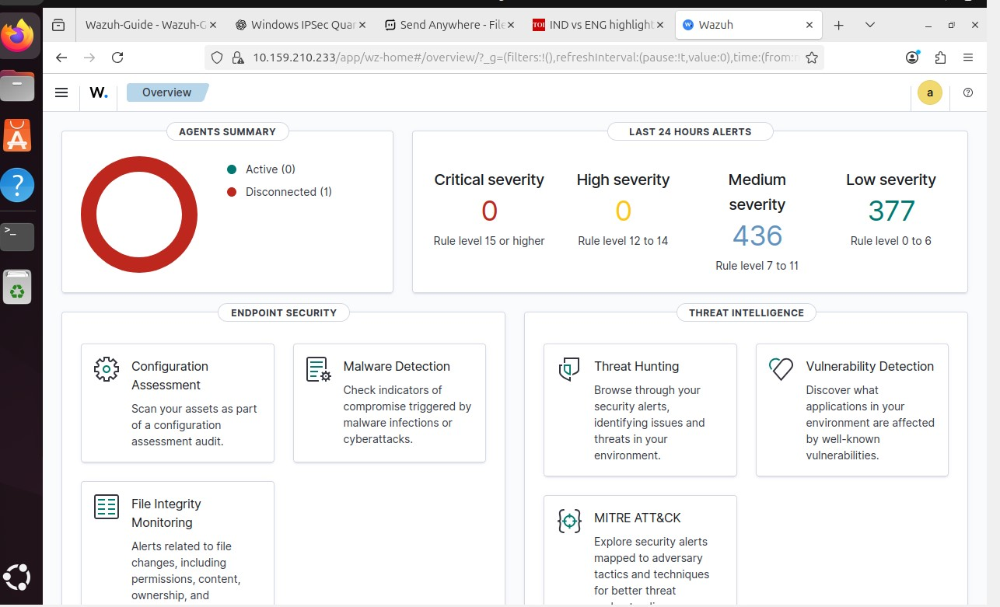

# 🛡️ Wazuh SIEM & File Integrity Monitoring Home Lab

## 📌 Overview
This project demonstrates the setup of **Wazuh**, an open-source SIEM platform, in a virtual lab environment for:
- ✅ Log analysis
- ✅ File Integrity Monitoring (FIM)
- ✅ Basic security event detection

It serves as a **beginner-friendly cybersecurity project** to understand SIEM concepts and how agents collect logs/events for centralized monitoring.

---

## 🏗️ Lab Architecture
- **Wazuh Manager** → Ubuntu Server (VirtualBox)
- **Wazuh Agent** → Windows VM
- **Networking** → Bridged Adapter (both VMs on same LAN)

---

## ⚙️ Steps Performed
1️⃣ **Installed Wazuh Manager** on Ubuntu 20.04 using Wazuh’s installation script.  
2️⃣ **Accessed the Wazuh Dashboard** via browser using Ubuntu VM’s IP.  
3️⃣ **Installed Wazuh Agent** on Windows.  
4️⃣ **Registered Agent with Manager** using generated keys.  
5️⃣ **Configured File Integrity Monitoring (FIM)** for a test folder on Windows.  
6️⃣ **Verified Alerts** on Wazuh dashboard when files were created, modified, or deleted.

---

## 📷 Screenshots

  figure1:Wazuh dashboard  

---

## 🛠️ Tech Stack
- 🖥️ VirtualBox (for virtualization)
- 🐧 Ubuntu 20.04 LTS (Manager)
- 🪟 Windows 10/11 (Agent)
- 🛡️ Wazuh 4.12

---

## 📚 What I Learned
- How SIEM tools collect and analyze security logs.
- How File Integrity Monitoring works in a real environment.
- Basics of managing Wazuh agents and dashboard alerts.

---

## 🚀 How to Recreate This Project
Follow the [setup-guide.md](setup-guide.md) for detailed step-by-step instructions.

---

## 📌 Future Improvements
- Add Linux agent integration.
- Enable alerting via email/Slack.
- Explore vulnerability detection features in Wazuh.

---

👨‍💻 **Author:** Abhimanyu R  
📅 **Date:** 2025
